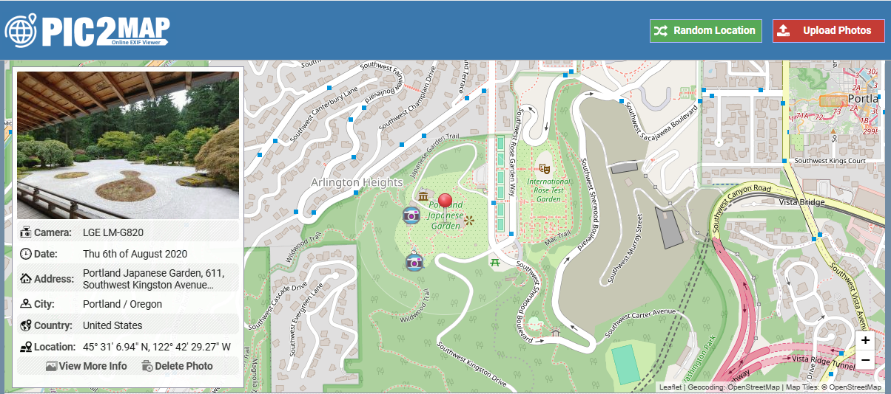
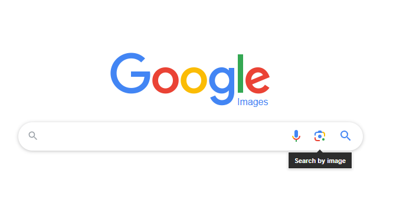
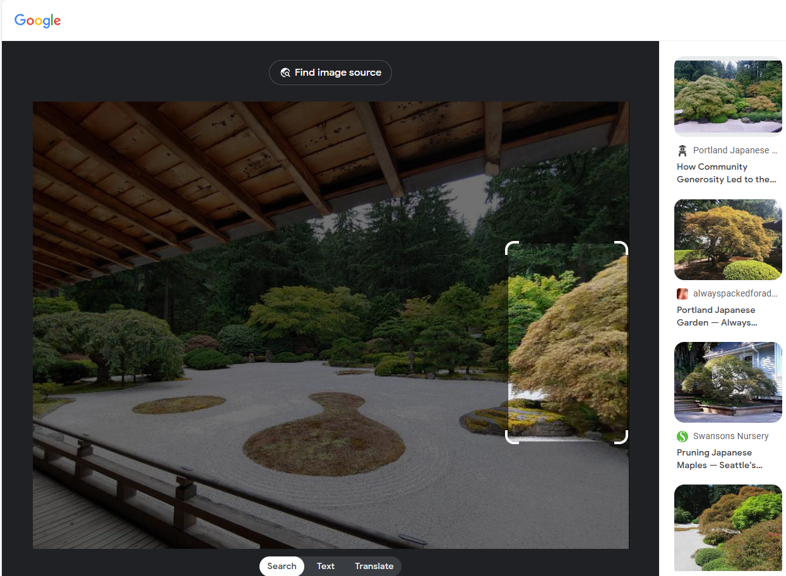

# How to get the GeoIP of an image
Not every image will have GPS coordinates within an image, but there sometimes will be a GPS coordinate in the RAW image. Some cameras by thesemlves will put GPS coordinates into the photo. Most phones will put the GPS coordinates into the photo unless the user configured the camera to not save GPS coordinate tagging in the photo. Images generated with PhotoShop or AI will not have GPS coordinates in them unless they are explicitly put in there. Also, some tools can edit GPS coordinates, and then you will have to do an image lookup for a location. Today will use an example photo from the Portland Japanese Gardens.

# The image


# First, using exiftool on Linux
On Windows 11 with WSL 2, you have access to Kali Linux. This distro has access to exiftool.
```
C:\Windows\System32> wsl -d kali-linux
```
## Installing exiftool on Linux
```
sudo apt install exiftool
```
## Scan the image using exiftool
```
┌──(mito㉿Mitobox)-[/mnt/d/Pictures/Japanese Gardens Part 2]
└─$ exiftool 20200806_144547.jpg | grep GPS
GPS Latitude Ref                : North
GPS Longitude Ref               : West
GPS Altitude Ref                : Above Sea Level
GPS Time Stamp                  : 21:45:46
GPS Processing Method           : GPS
GPS Date Stamp                  : 2020:08:06
GPS Altitude                    : 70.5 m Above Sea Level
GPS Date/Time                   : 2020:08:06 21:45:46Z
GPS Latitude                    : 45 deg 31' 6.94" N
GPS Longitude                   : 122 deg 42' 29.27" W
GPS Position                    : 45 deg 31' 6.94" N, 122 deg 42' 29.27" W
```

### Google Map the coordinates


# Using a website to get GPS coordinates
## [PIC2Map](https://www.pic2map.com/)


# Using a reverse image search


# Results from google image search


# First link made by Google
