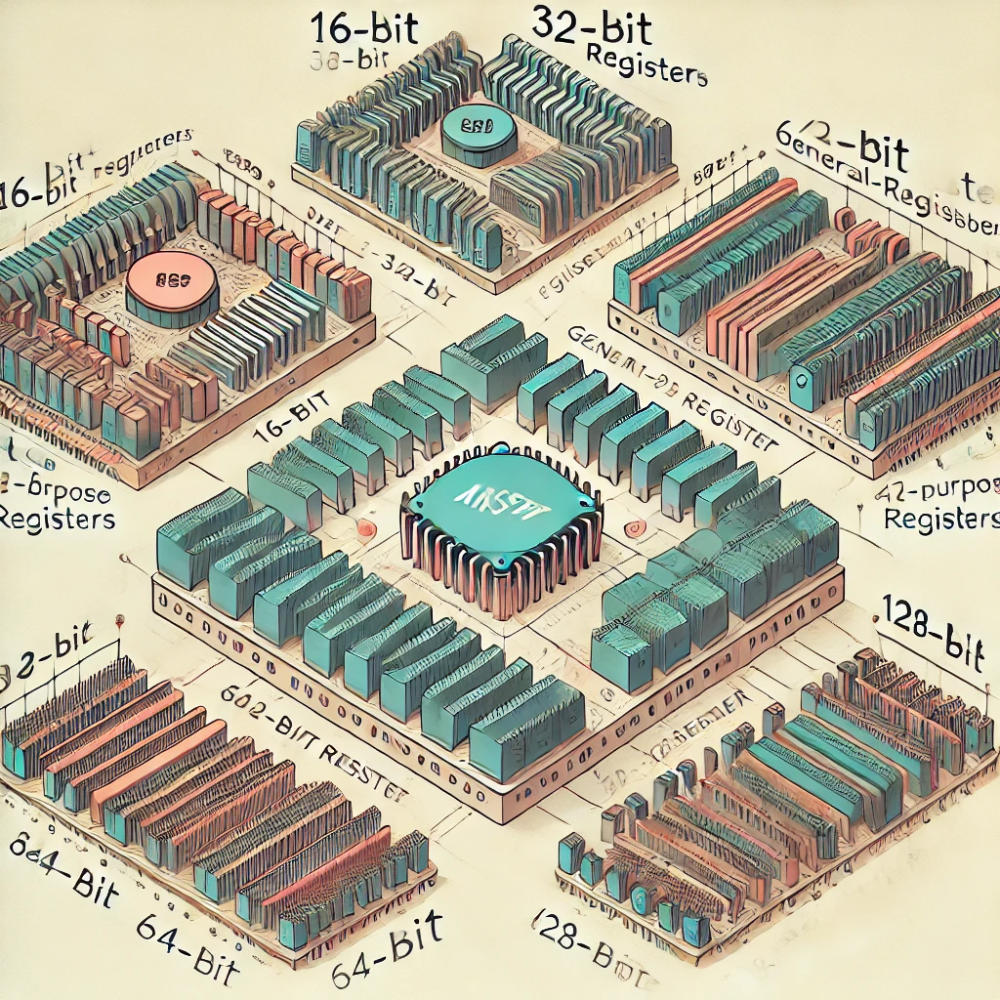

# General Purpose Registers


# WinDBG

### [Registers in WinDBG](https://learn.microsoft.com/en-us/windows-hardware/drivers/debuggercmds/r--registers-)

# GDB

### [Registers in GDB](https://ftp.gnu.org/old-gnu/Manuals/gdb/html_node/gdb_60.html)

# Some example code

```
section .text
    global _start

_start:
    mov rdx, 0x1234567890ABCDEF  ; Load a 64-bit value into RDX
    mov edx, 0x90ABCDEF          ; Load a 32-bit value into EDX (affects lower 32 bits of RDX)
    mov dx, 0xBCDE               ; Load a 16-bit value into DX (affects lower 16 bits of EDX)
    mov dh, 0xAB                 ; Load an 8-bit value into DH (affects bits 8-15 of DX)
    mov dl, 0xCD                 ; Load an 8-bit value into DL (affects bits 0-7 of DX)

    ; At this point:
    ; RDX = 0x123456780000ABCD
    ; EDX = 0x0000ABCD
    ; DX  = 0xABCD
    ; DH  = 0xAB
    ; DL  = 0xCD

    ; Exit the program
    mov eax, 60                  ; syscall number for exit
    xor edi, edi                 ; exit code 0
    syscall
```
```
section .text
    global _start

_start:
    mov al, 0x12          ; Load 0x12 into AL (low byte of AX)
    mov ah, 0x34          ; Load 0x34 into AH (high byte of AX)
    mov bl, 0x56          ; Load 0x56 into BL (low byte of BX)
    mov bh, 0x78          ; Load 0x78 into BH (high byte of BX)
    mov cl, 0x9A          ; Load 0x9A into CL (low byte of CX)
    mov ch, 0xBC          ; Load 0xBC into CH (high byte of CX)
    mov dl, 0xDE          ; Load 0xDE into DL (low byte of DX)
    mov dh, 0xF0          ; Load 0xF0 into DH (high byte of DX)

    ; In x86-64, you can also use the additional 8-bit registers
    mov r8b, 0x11         ; Load 0x11 into R8B (lower 8 bits of R8)
    mov r9b, 0x22         ; Load 0x22 into R9B (lower 8 bits of R9)

    ; Exit the program
    mov eax, 60           ; syscall number for exit
    xor edi, edi          ; exit code 0
    syscall
```
```
section .text
    global _start

_start:
    mov rax, 0x1234567890ABCDEF  ; Load a 64-bit value into RAX
    mov rbx, 0x0FEDCBA987654321  ; Load a 64-bit value into RBX
    add rax, rbx                 ; Add RBX to RAX

    mov r8, rax                  ; Move the result to R8
    mov r9, rbx                  ; Move RBX to R9

    ; Exit the program
    mov eax, 60                  ; syscall number for exit
    xor edi, edi                 ; exit code 0
    syscall
```
## 8-bit registers
| 8-bit Register | Description                          |
|----------------|--------------------------------------|
| AH             | High byte of AX                      |
| AL             | Low byte of AX                       |
| BH             | High byte of BX                      |
| BL             | Low byte of BX                       |
| CH             | High byte of CX                      |
| CL             | Low byte of CX                       |
| DH             | High byte of DX                      |
| DL             | Low byte of DX                       |
| R8B            | Lower 8 bits of R8 (x86-64 only)     |
| R9B            | Lower 8 bits of R9 (x86-64 only)     |
| R10B           | Lower 8 bits of R10 (x86-64 only)    |
| R11B           | Lower 8 bits of R11 (x86-64 only)    |
| R12B           | Lower 8 bits of R12 (x86-64 only)    |
| R13B           | Lower 8 bits of R13 (x86-64 only)    |
| R14B           | Lower 8 bits of R14 (x86-64 only)    |
| R15B           | Lower 8 bits of R15 (x86-64 only)    |

## 16-bit registers
| 16-bit Register | Description                          | High Byte | Low Byte | 
|-----------------|--------------------------------------|-----------|----------|
| AX              | Accumulator Register                 | AH        | AL       |
| BX              | Base Register                        | BH        | BL       |
| CX              | Count Register                       | CH        | CL       |
| DX              | Data Register                        | DH        | DL       |
| SI              | Source Index Register                | -         | -        |
| DI              | Destination Index Register           | -         | -        |
| BP              | Base Pointer Register                | -         | -        |
| SP              | Stack Pointer Register               | -         | -        |

1.	AX (Accumulator Register):
    -	Used for arithmetic operations and I/O operations.
    -	Can be divided into two 8-bit registers: AH (high byte) and AL (low byte).
2.	BX (Base Register):
    -	Used as a base pointer for memory access.
    -	Can be divided into two 8-bit registers: BH (high byte) and BL (low byte).
3.	CX (Count Register):
    -	Used as a counter in loop operations and for string operations.
    -	Can be divided into two 8-bit registers: CH (high byte) and CL (low byte).
4.	DX (Data Register):
    -	Used in arithmetic operations and I/O operations.
    -	Can be divided into two 8-bit registers: DH (high byte) and DL (low byte).
5.	SI (Source Index Register):
    -	Used as a source pointer for string operations.
6.	DI (Destination Index Register):
    -	Used as a destination pointer for string operations.
7.	BP (Base Pointer Register):
    -	Used to point to the base of the stack frame.
8.	SP (Stack Pointer Register):
    -	Points to the top of the stack.
# 32-bit registers
-	EAX: Extended Accumulator Register (includes AX)
-	EBX: Extended Base Register (includes BX)
-	ECX: Extended Count Register (includes CX)
-	EDX: Extended Data Register (includes DX)
-	ESI: Extended Source Index (includes SI)
-	EDI: Extended Destination Index (includes DI)
-	EBP: Extended Base Pointer (includes BP)
-	ESP: Extended Stack Pointer (includes SP)

# 64-bit registers 
| 64-bit Register | Description                          |
|-----------------|--------------------------------------|
| RAX             | Extended Accumulator Register        |
| RBX             | Extended Base Register               |
| RCX             | Extended Count Register              |
| RDX             | Extended Data Register               |
| RSI             | Extended Source Index                |
| RDI             | Extended Destination Index           |
| RBP             | Extended Base Pointer                |
| RSP             | Extended Stack Pointer               |
| R8              | General Purpose Register 8           |
| R9              | General Purpose Register 9           |
| R10             | General Purpose Register 10          |
| R11             | General Purpose Register 11          |
| R12             | General Purpose Register 12          |
| R13             | General Purpose Register 13          |
| R14             | General Purpose Register 14          |
| R15             | General Purpose Register 15          |

```

RAX (64-bit)
├── EAX (32-bit)
│   ├── AX (16-bit)
│   │   ├── AH (8-bit high)
│   │   └── AL (8-bit low)
│   └── (remaining 16 bits)
└── (remaining 32 bits)

RBX (64-bit)
├── EBX (32-bit)
│   ├── BX (16-bit)
│   │   ├── BH (8-bit high)
│   │   └── BL (8-bit low)
│   └── (remaining 16 bits)
└── (remaining 32 bits)

... (similar structure for RCX, RDX, etc.)
```