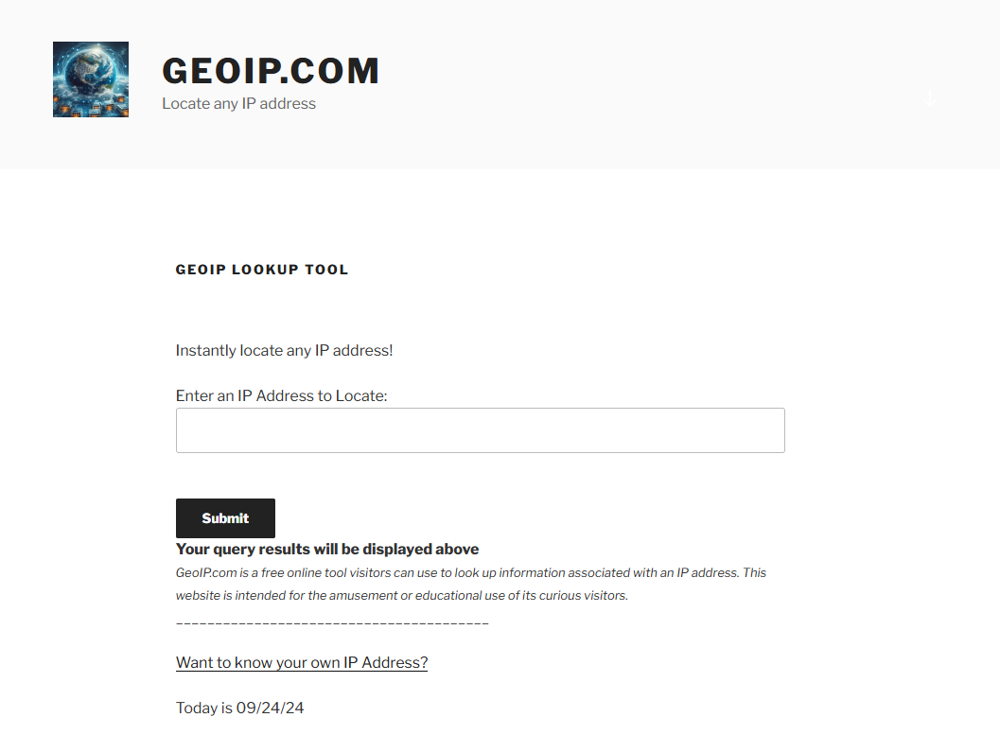

# How to look up a website domain GeoIP
# Select a domain, example `https://www.google.com/` --> `google.com`
### Use [Google DNS Toolbox](https://toolbox.googleapps.com/apps/dig/#A/)
Remember, `www.google.com` is a different address in most cases from `google.com`, meaning the root domain is often different from the subdomain addresses, even for WWW CNAME records.
### Input a domain
### Select A Record

### Check the data in Raw View or regular view
```
id 63398
opcode QUERY
rcode NOERROR
flags QR RD RA
;QUESTION
google.com. IN A
;ANSWER
google.com. 300 IN A 74.125.136.101
google.com. 300 IN A 74.125.136.139
google.com. 300 IN A 74.125.136.102
google.com. 300 IN A 74.125.136.113
google.com. 300 IN A 74.125.136.100
google.com. 300 IN A 74.125.136.138
;AUTHORITY
;ADDITIONAL
```
## Use a GeoIP Service to look up the domain

### [geoip.com](https://geoip.com/)

```
success
United States
CA
California
Mountain View
94043
37.422
-122.084
Google LLC
Google LLC
AS15169 Google LLC
false
false
74.125.136.101
```

## Go to a Map service to look up the GPS Coordinates
### [Google Maps Link](https://www.google.com/maps/place/37%C2%B025'19.2%22N+122%C2%B005'02.4%22W/@37.422,-122.0865749,887m/data=!3m2!1e3!4b1!4m4!3m3!8m2!3d37.422!4d-122.084?entry=ttu&g_ep=EgoyMDI0MDkxOC4xIKXMDSoASAFQAw%3D%3D)
### [Google Maps Short Link](https://maps.app.goo.gl/zSYuNLKzkxxiKESN9)
