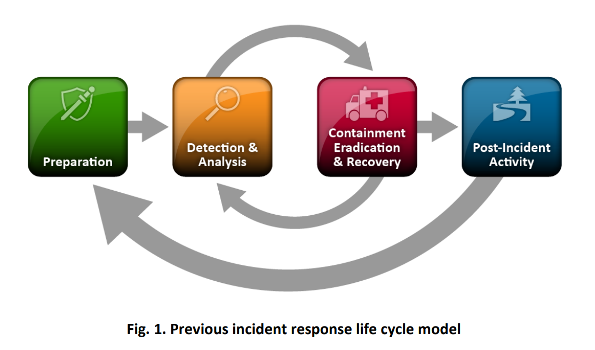

# NIST - Incident Response

### Current
- [NIST SP 800-61r3 - Incident Response Recommendations and Considerations for Cybersecurity Risk Management](https://nvlpubs.nist.gov/nistpubs/SpecialPublications/NIST.SP.800-61r3.pdf)

### Withdrawn
- [NIST SP 800-61r2 - Computer Security Incident Handling Guide](https://nvlpubs.nist.gov/nistpubs/SpecialPublications/NIST.SP.800-61r2.pdf)

