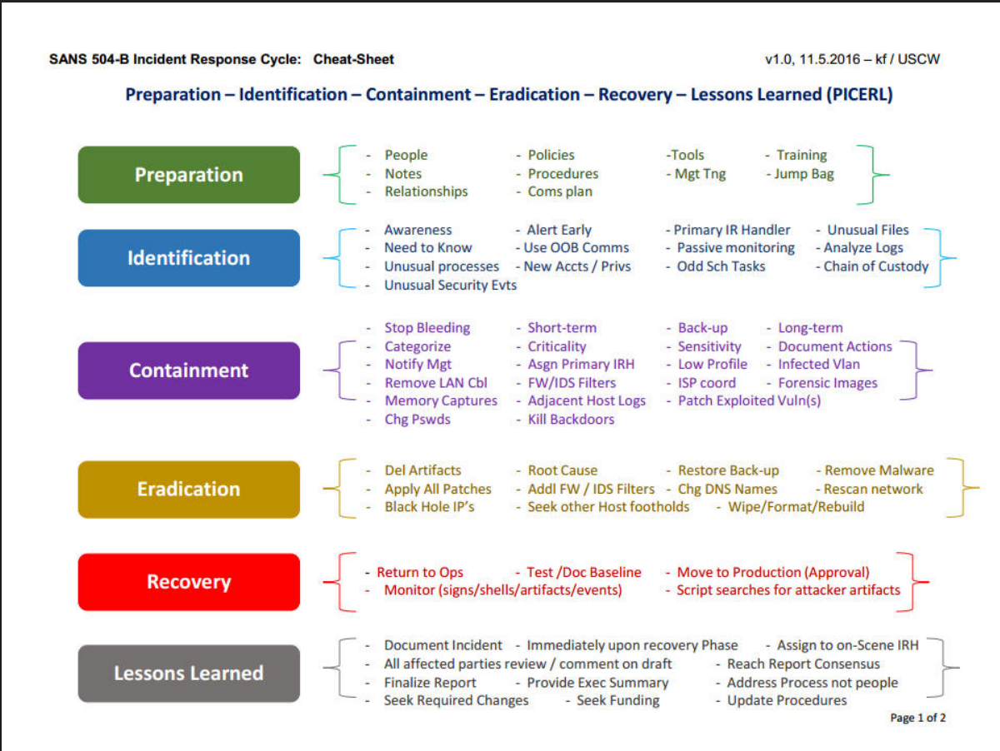

# SANS - Incident Response

### Incident Response Framework
- [SANS - Incident Response 6 Step Process Critical Best Practices](https://www.exabeam.com/explainers/incident-response/sans-incident-response-6-step-process-critical-best-practices/)

### 504B - Incident Response Cycle
- [SANS 504B - Incident Response Cycle: Cheat-Sheet](https://www.sans.org/media/score/504-incident-response-cycle.pdf)

### IR Handbook
- [SANS Incident Handler's Handbook](https://www.sans.org/white-papers/33901/)
    - [SANS Incident Handler's Handbook - DL Link](https://sansorg.egnyte.com/dl/SzUc95nE0x)