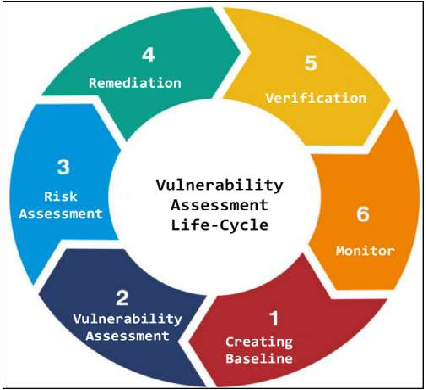

# Models and Lifecycles

-	Software Development Lifecycle (SDLC): Starts with planning a new software project and stops when the software is retired.
-	IT Service Management Lifecycle (ITIL): Starts with service strategy and continues indefinitely, with services being continually improved or retired.
-	Project Management Lifecycle (PMLC): Starts with project initiation and stops with project closure.
-	System Development Lifecycle (SDLC for Systems): Starts with system initiation and stops with system disposition.
-	Security Development Lifecycle (SDL): Starts with training for a new project and stops when the software is retired.
-	Data Lifecycle Management (DLM): Starts with data creation and stops with data destruction.

# Diamond Model of Security Analysis

https://www.eccouncil.org/cybersecurity-exchange/ethical-hacking/diamond-model-intrusion-analysis/

https://www.threatintel.academy/wp-content/uploads/2020/07/diamond_summary.pdf

[Summary of the Diamond Mode](./files/diamond_summary.pdf)

# Lockheed Martin Cyber Kill Chain 

https://www.lockheedmartin.com/en-us/capabilities/cyber/cyber-kill-chain.html

https://www.eccouncil.org/cybersecurity-exchange/threat-intelligence/cyber-kill-chain-seven-steps-cyberattack/

# Threat Intelligence Lifecycle

https://www.recordedfuture.com/blog/threat-intelligence-lifecycle-phases

# Microsoft Security Development Lifecycle

https://www.microsoft.com/en-us/securityengineering/sdl/

# Software Development Lifecycle

https://aws.amazon.com/what-is/sdlc/

1.	Planning: Define the project scope, objectives, and requirements.
2.	Analysis: Gather detailed requirements and analyze them.
3.	Design: Create architectural and detailed design specifications.
4.	Implementation: Write and compile the code.
5.	Testing: Test the software to identify and fix defects.
6.	Deployment: Deploy the software to the production environment.
7.	Maintenance: Perform ongoing maintenance and updates.

# System Development Lifecycle

https://www.nist.gov/publications/system-development-life-cycle-sdlc

# Incident Response Lifecycle

https://www.eccouncil.org/cybersecurity-exchange/incident-handling/what-is-incident-response-life-cycle/

# Vulnerability Management Lifecycle

https://sprinto.com/blog/from-discovery-to-remediation-6-stages-of-vulnerability-management-lifecycle/

# Risk Management Lifecycle 

# IT Service Management Lifecycle (ITIL)

1.	Service Strategy: Define the strategy for IT services.
2.	Service Design: Design new or changed services.
3.	Service Transition: Transition new or changed services into the live environment.
4.	Service Operation: Manage services in the live environment.
5.	Continual Service Improvement: Continuously improve services and processes.

# Project Management Lifecycle

1.	Initiation: Define the project and obtain authorization.
2.	Planning: Develop a detailed project plan.
3.	Execution: Execute the project plan and perform the work.
4.	Monitoring and Controlling: Track, review, and regulate project performance.
5.	Closure: Finalize all activities and formally close the project.

# System Development Lifecycle

1.	Initiation: Identify the need for a new system.
2.	System Concept Development: Define the system's high-level requirements.
3.	Planning: Develop a detailed project plan for system development.
4.	Requirements Analysis: Gather and analyze detailed system requirements.
5.	Design: Create system architecture and detailed design.
6.	Development: Build and configure the system.
7.	Integration and Testing: Integrate and test the system components.
8.	Implementation: Deploy the system to the production environment.
9.	Operations and Maintenance: Operate and maintain the system.
10.	Disposition: Retire and dispose of the system.

### Notes on NIST considerations

1.	NIST SP 800-64 Rev. 2: Security Considerations in the System Development Life Cycle
  -	Link: [NIST SP 800-64 Rev. 2](https://csrc.nist.gov/pubs/sp/800/64/r2/final)
    - [NIST SP 800-160 Volume 1](https://csrc.nist.gov/pubs/sp/800/160/v1/upd2/final)
    - Risk Management Framework [SP 800-37 Rev. 2](https://csrc.nist.gov/pubs/sp/800/37/r2/final)
  -	Description: Provides guidance on integrating security into the SDLC, including security considerations for each phase of the lifecycle.
2.	NIST SP 800-37 Rev. 2: Risk Management Framework for Information Systems and Organizations
  -	Link: NIST SP 800-37 Rev. 2
  -	Description: Describes the Risk Management Framework (RMF) and how it integrates with the SDLC to manage security and privacy risks.
3.	NIST SP 800-53 Rev. 5: Security and Privacy Controls for Information Systems and Organizations
  -	Link: NIST SP 800-53 Rev. 5
  -	Description: Provides a catalog of security and privacy controls that can be applied throughout the SDLC.

# Data Lifecycle Management (DLM)

1.	Creation: Generate or collect new data.
2.	Storage: Store data securely.
3.	Usage: Access and use data for various purposes.
4.	Sharing: Share data with authorized users or systems.
5.	Archiving: Move data to long-term storage.
6.	Destruction: Securely delete or destroy data.